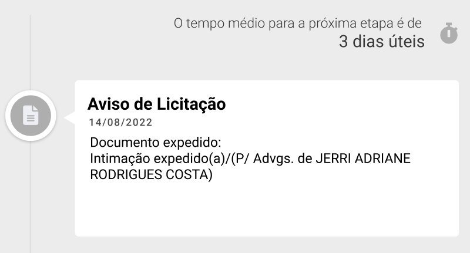

# O Desafio

O desafio consiste na implementação de duas páginas principais:
- Uma página de consulta processual; e
- uma página de processos.

Essa implementação deve usar ReactJs no front-end e o backend fica à critério.

Nesse desafio, os processos podem ser cadastrados com dados fake e devem possuir os seguintes dados:

- Número CNJ no formato `NNNNNNN-NN.NNNN.N.NN.NNNN` Ex.: 5001682-88.2020.8.13.0672;
- Nome das partes (Autor x Réu);
- Tribunal de origem (Ex.: TJSP);
- Data de início;
- Movimentações;
  - Data;
  - Descrição;

# Coleta de dados
Inicialmente, tive a ideia de usar dados reais na população do banco de dados, para obter insights mais úteis no desenvolvimento da interface, e também para reproduzir uma experiência mais realista. Sendo assim, desenvolvi um gerador de números CNJ aleatórios, a fim de usar em sites de consulta pública e popular meu banco. 

Notei, contudo, que essa implementação não é eficiente pois a quantidade de casos que precisariam ser testados para retornar um código válido demorariam mais de três minutos. Vi que os processos de diversas áreas são publicadas no Diário de Justiça Eletrônico, mas isso iria requerer processos de identificação e processamento de texto muito árduos, e cada um dos DJe's tem estruturas de texto diferente, o que levaria a implementações diferentes para cada um deles.

Analisando possibilidades alternativas, notei que existem serviços de consultas processuais, bastava procurar uma forma de realizar buscas que retornem múltiplos processos.
Então, busquei relações entre os campos de busca e os processos, até atinar que todos os processos tem em comum a presença de um advogado. Pesquisando por advogados, eu conseguiria uma boa quantidade de processos por busca, com baixas taxas de buscas sem resultados.

A etapa anterior me leva ao próximo desafio: encontrar uma lista de advogados separados por estado. Pesquisando, encontrei os resultados dos exames da OAB, com os nomes de todos que passaram e seus respectivos estados.
Apliquei um webscrapping na página da OAB para baixar os arquivos PDF com os resultados e extraí o texto de todos eles, separando os nomes com REGEX. Com os nomes separados, gerei um arquivo JSON.

Para realizar o crawling nas páginas de consulta pública, considerando também que minha prioridade deve ser a implementação do frontend, optei por limitar a população dos dados a processos que estejam em um sistema de PJE, reduzindo a necessidade de implementação e simplificando a filtragem de dados obtidos.

Foram selecionados 11 estados brasileiros com sistemas de consulta PJE, entre Tribunais de Justiça, Tribunais Regionais Federais e o Conselho Nacional de Justiça. São eles:
- Amapá (TJPA)
- Amazonas (TRF1)
- Ceará (TJCE)
- Distrito Federal (CNJ)
- Espírito Santo  (TJES)
- Mato Grosso (TJMT)
- Minas Gerais (TJMG)
- Paraíba (TJPB)
- Piauí (TRF1)
- Tocantins (TRF1)

# Processamento dos dados
Após o crawling, foram gerados arquivos JSON, separados por estados, com os processos coletados. Além disso, os dados de participantes também foram processados para distinguir CPF, Código da OAB e nomes, dentro das entidades.

# Banco de Dados
A primeira ideia foi utilizar um banco de dados Postgres para fazer a persistência, mas considerando o foco deste desafio, optei por gerar um arquivo .json e utilizar a leitura dele no backend.

# Prototipação
Antes de planejar os endpoints, foquei em idealizar e desenhar a página. Visando aproveitar o realismo dos dados, decidi adiar a estruturação da API e focar no protótipo para ter melhor noção dos requisitos.

## As personas
Para começar, busquei elaborar os perfis de usuário da ferramenta. Para isso, observei a interface de serviços que realizam consultas processuais, e também conversei com pessoas que estudam ou trabalham na área do direito. A partir dessas experiências, cheguei a dois perfis básicos:
- Usuário médio: Aquele que não tem formação em direito, mas está sendo autor ou réu de algum processo, tem um familiar ou amigo sendo processado e deseja acompanhar todas as movimentações;
- Usuário da área: Aquele que tem formação em direito, incompleto ou completo, e que usa essa ferramenta para estudar e notificar seus possíveis clientes.

As duas personas devem ser consideradas na implementação desta interface. Contudo, a segundo já está suprida de serviços e ferramentas. Dessa forma, optei por desenvolver uma ferramenta mais amigável e acessível para usuários que não são familiarizados com assuntos jurídicos.

## A jornada do usuário
### Acessibilidade de Linguagem
Uma das principais barreiras de acessibilidade é o "juridiquês", muito presente nas ferramentas de consultas processuais. Com este foco, foram implementadas tooltips para exibir o significado de termos de baixa popularidade.

### Identificação dos processos
Na jornada imaginada para o perfil em foco, uma das situações projetadas foi o acompanhamento de processos. Essa projeção deduziu a ansiedade do usuário por novas movimentações no processo, e a consequente reabertura contínua da página para realizar a mesma pesquisa de processo. A fim de atender a essas necessidades do usuário, foram implementados dois recursos: 
 - A implantação de um histórico, com os últimos processos acessados;
 - Um componente que aponta a previsão para a próxima movimentação, com base na análise de processos de mesmo assunto no banco de dados; e
 - Sinalização de nova movimentação baseada no estado da última visita.
  

### Identificação dos participantes
Conversando com especialistas, nota-se que é comum os advogados conhecerem uns aos outros, bem como os juízes e promotores que participam do caso. O usuário médio, no entanto, não conhece esses integrantes, bem como não conhece suas participações, taxa de vitórias nos processos de mesmo assunto que o caso de interesse. Assim, decidi implementar uma seção de exibição de estatísticas do advogado ou da empresa, conforme a participação na ferramenta, exibindo casos procedentes, não procedentes e em andamento.

### Pesquisa Auxiliada
O método mais eficaz de se chegar a um processo é através do código CNJ. Contudo, este código é consideravelmente longo para se manter registro. Além disso, de acordo com os especialistas entrevistados, os advogados que realizam buscas processuais já tem fixada parte desse código em suas ferramentas. A parte fixada é referente à comarca ou tipo de processo procurado. Para o usuário médio, pesquisar com esses parâmetros é desestimulante, exigindo alta carga cognitiva.

Com este foco, tentei tornar a lógica de filtros mais funcional possível, utilizando filtro pelos campos indicativos do código CNJ. Além disso, planejo que esses filtros, após repetidas utilizações, fiquem salvos na sessão do usuário, a fim de que ele não precise repetir a escolha desses filtros.

### Notificações
Os especialistas indicaram uma demanda recorrente dos usuários, que é a insistência dos clientes em perguntar por atualizações dos processos. Considerando que a ferramenta, em uma implementação real, teria conexão com as atualizações dos movimentos de cada processo, tive a ideia de criar um campo de assinatura de notificações para receber por e-mail quando um processo tiver nova movimentação.

## Protótipo de alta fidelidade
Segue o link para o [protótipo](https://www.figma.com/file/AoJfWNcGzBFz3HbJKP08q7/JusBrasil?node-id=16%3A284&t=As1HsAVdi7IufPT5-1), com as versão de alta fidelidade, wireframe, mobile e fundações do sistema de design. Válido ressaltar que alguns elementos presentes na página já implementada não estão conforme os protótipos, devido a modificações posteriores.

## A Interface
No wireframe, imaginei o foco repartido entre a movimentação e os detalhes do processo. Ambos são bem queridos pelos usuários que buscam a ferramenta. Sendo assim, apliquei um componente de timeline vertical, a fim de trazer dinamismo e uma estética moderna, e se diferenciando de uma lista simples, comum em outras ferramentas. Assim, o conteúdo do processo é mostrado em abas, na esquerda, enquanto a movimentação é exibida na direita, simplificando a busca do usuário.

Na busca, foquei em fazer um sistema simples, com foco unificado. Então, a tela inicial tem campo de busca centralizado, apenas com a logo acima e as opções de filtragem a mostra, trazendo intuitividade na utilização.

# API
A framework escolhida para a API foi a FastAPI, devido sua fácil implementação, alta eficiência e a interface Swagger, permitindo realizar testes manuais pelo navegador. 

## Endpoints
Após a prototipação e prospecção de ideias para implementação, foram arquiteturados cinco endpoints de forma a suprir essas ideias e tornar a aplicação mais dinâmica e mais eficiente possível.

### api/ (GET)
A partir do endpoint raíz, pelo método GET, é possível realizar buscas simples, sem filtros. Esse endpoint, retorna uma lista de processos, com seu número de identificação e dados relacionados ao processo, como jurisdição e Órgão Julgador.

### api/ (POST)
Parametrizável pelos campos da entidade de processo, esse endpoint retorna os resultados da busca com filtros, permitindo uma busca com maior acuracia

### api/{id} (GET)
A partir desse endpoint, com a chave definida, a API retorna todos os dados completos de um processo, necessário para abastecer a página de descrição do processo.

### api/participants/{id} (GET)
Por esse endpoint, obtém-se a lista de participantes, separados por participantes ativos, passivos e outros participantes do processo.

### api/movement/{id} (GET)
Nesse endpoint, retorna-se a lista de movimentações. Cada item da lista contém o conteúdo da movimentação e um objeto com data e hora da movimentação.

### api/filters/ (POST)
A partir desse endpoint, obtém-se os itens dos filtros no campo de busca. Os itens são dinâmicos conforme a definição de filtros anteriores, fazendo-se necessária esse recurso.

# Implementação

## Desempenho
Segui toda a implementação focada em manter o desempenho da interface. Usei recursos de memoização dos estados e redução de renderizações, como os hooks useCallback() e useMemo().

## Linguagens e decisões
Optei pelo uso da framework Next.js, considerando a facilidade de roteamento que a ferramenta retorna, e alguns recursos como server-side rendering, entre outros (que infelizmente não pude aplicar devido a falta de tempo).

A linguagem utilizada foi o Typescript, a fim de reduzir erros de tipagem e melhor estabilidade no escopo do código.

### UI
Para implementação da interface gráfica, optei pelo ChakraUI. Ele facilita a responsividade dos componentes, bem como sua tematização, e fornece os próprios hooks para utilização dos seus recursos. A escolha dessa framework garantiu maior estabilidade e legibilidade para o código, além de poupar estruturações de diretórios com arquivos de estilo em CSS ou SASS, que mesmo com bom retorno, requerem maior complexidade à organização dos diretórios.

# Se desse tempo...
Planejei vários recursos interessantes para a plataforma a fim de demonstrar mais das minhas soft e hard skills. Contudo, a aplicação das mesmas demandariam maior tempo que o disponível. A seguir, segue uma lista das principais implementações e modificações que eu faria se tivesse maior disponibilidade de tempo.

## Coleta de dados
Foram catalogados 3307 processos, dos tribunais e varas já citados. Não foi possível registrar mais processos, pois o PJE de algumas páginas são protegidos por Captcha. Assim, filtrei os tribunais apenas pelos que não tinham essa verificação.

Além disso, a limpeza dos dados não foi completa. Algumas informações, como a listagem dos dados e os assuntos podem ser apresentados na ferramenta com alguns ruídos, pois o tratamento desses dados é muito custoso em tempo e verificação.

Essas impurezas impediram a implementação de alguns componentes planejados e prototipados, como o da previsão de intervalo de tempo entre as etapas do processo, pois não era possível fazer a busca necessária.

Idealmente, faria a sanitização adequada dos dados, identificando as movimentações e obtendo mais adequadamente os assuntos. Assim, faria um endpoint get que me retornaria a previsão com base na média de avanço de etapas do mesmo tipo em dados registrados.

## Componentes idealizados
Nas entrevistas com os especialistas, tive algumas ideias interessantes se implementadas. Um dos parâmetros úteis para se observar em um processo é a verificação de prazos. Foram relatados casos de pessoas que tiveram o processo não procedente pois o advogado não verificou o prazo de entrega de documentações, e não checou as movimentações. Assim, é interessante a criação de um componente que indica os prazos em aberto, assim como planejou-se com a previsão do intervalo entre cada movimentação.

Verifiquei que em algumas bases de dados é possível realizar mineração de texto e outras técnicas de obtenção de dados, obtendo assim os prazos nos processos. Com um modelo de persistência de dados mais adequado, faria o registro dessas médias, na mesma periodicidade da atualização dos processos registrados.

## Animações
Planejei adicionar animações nos componentes, como na abertura dos cards dos processos, transições entre as abas e exibição dos resultados da busca.

Planejei também animar os ícones, a fim de tornar a página mais amigável e moderna para o usuário.

## Perfilamento dos advogados
Idealizei uma página para exibir a descrição dos advogados, suas estatísticas em relação aos dados presentes na plataforma, bem como perfis de juízes e empresas.

Esse perfil pode ser útil para o usuário, seja advogado ou não, saber sobre a procedência de processos relacionados a determinados assuntos que determinado advogado ou empresa foi participante.

Na implementação ideal, os advogados e as empresas teriam seus registros em tabelas, posicionando suas identificações que seriam rastreáveis no corpo de cada processo. Desse modo, seria posível obter seus insights e estatísticas.

# Arquitetura
O projeto ficou dividido em 4 containers, dividindo o proxy nginx, a api, o projeto em React e um de testes.
Em uma visão geral, a arquitetura consiste no usuário que realiza buscas no Probusca (Container: Probusca_server), que se alimenta da API (Container: Probusca_api), que foi alimentada por um script em um notebook presente na pasta `./coleta`.

O container de testes (Container: test) realiza testes do ponto de vista do front, utilizando Cypress, visitando de forma geral as principais utilizações do usuário.

Por fim, chegamos ao Nginx que realiza o proxy reverso, facilitando o acesso dos containers, como também tornando possível a melhor testagem dos componentes.

## Marcação do último item lido na movimentação e salvar dados de filtragem
Foi idealizada a implementação de uma verificação e armazenamento da última movimentação vista pelo usuário na página, notificando as atualizações em seu próximo acessos. Além disso, também idealizou-se o registro dos fitros usados repetidamente e seu posterior auto-preenchimento.

O Next.JS tem uma limitação grande no que se refere ao registro de dados de sessão. Com essa limitação não superada, não foi possível implementar tais recursos que facilitariam a vida dos usuários, reduzindo sua busca e mostrando as atualizações da página.

Superada a limitação da sessão, os dados seriam registrados no local de sessão, e recuperados em cada acesso.